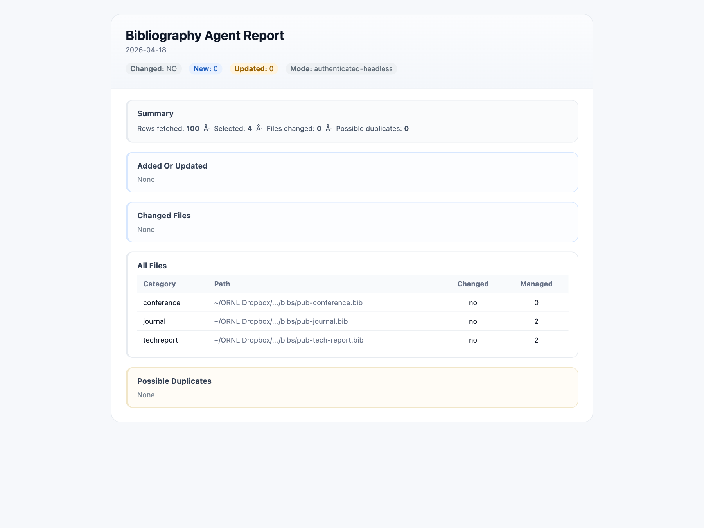

# Bibliography Agent

Bib Agent keeps personal BibTeX collections up to date from Google Scholar without disturbing hand-curated entries.

It discovers new publications from a Google Scholar profile, enriches incomplete metadata from DOI/Crossref, publisher pages, and arXiv, and safely updates one or more .bib files. Runs are idempotent, and email reports are sent whenever entries are added or changed.

The tool maintains a strict ownership boundary: manual BibTeX outside the managed block is preserved, and agent-generated entries are written only inside the marked managed block. The only exception is when a manual tech-report or preprint entry is superseded by a published journal or conference version.

**What it does**
* Fetches publications from Google Scholar in reverse publication-date order
* Supports authenticated headless Scholar access via a saved browser session
* Updates one or more BibTeX files
* Routes entries into buckets such as conference, journal, and techreport
* Enriches metadata from DOI/Crossref, publisher pages, and arXiv
* Highlights configured author names.
* Produces text, JSON, and HTML change reports
* Emails reports when new or updated entries are detected
* Can render a bibliography-only PDF to verify compilation



## Setup

### Requirements

- `python3` 3.11+
- `node` and `npm`
- Google Chrome
- a TeX installation if you want PDF render checks

### Install browser dependency

```bash
cd /Users/f7b/Bib-Agent
npm install
```

### Configure the project

Start from [config.example.json](/Users/f7b/Bib-Agent/config.example.json) and create your local [config.json](/Users/f7b/Bib-Agent/config.json).

Example:

```bash
cp config.example.json config.json
```

Then edit [config.json](/Users/f7b/Bib-Agent/config.json).

The most important sections are:

- `scholar`
  - Google Scholar profile id
- `bib_files`
  - which BibTeX files are enabled and where they live
- `routing`
  - where `conference`, `journal`, and `techreport` records should go
- `baseline`
  - current workflow uses manual bibs as baseline and only considers Scholar items after the configured cutoff year
- `author_emphasis`
  - names to emphasize and whether to preserve original name order
- `notifications`
  - email transport and recipients

### Scholar authentication bootstrap

If you want authenticated Scholar fetches:

```bash
python3 update_bibs.py auth-bootstrap
```

This saves Scholar browser session state to:

- [state/scholar_storage_state.json](/Users/f7b/Bib-Agent/state/scholar_storage_state.json)

### Gmail API email setup

This project is currently configured to use Gmail API notification delivery.

Important fields in [config.json](/Users/f7b/Bib-Agent/config.json):

```json
"notifications": {
  "enabled": true,
  "transport": "gmail_api",
  "gmail_sender": "fwang2@gmail.com",
  "gmail_token_file": "~/sys/gmail/gmail_token.json",
  "gmail_creds_file": "~/sys/gmail/gmail_credentials.json",
  "report_from": "fwang2@ornl.gov",
  "report_recipients": ["fwang2@ornl.gov"]
}
```

The token and credential files are local secrets and should not be committed.

## Usage

### Update bib files

```bash
python3 update_bibs.py update
```

This will:

- fetch Scholar records,
- reconcile them against manual and agent-owned BibTeX content,
- update the managed blocks,
- write reports,
- send an email only if the run has `new` or `updated` entries.

### Bootstrap baseline

```bash
python3 update_bibs.py bootstrap
```

### Render PDF compile check

```bash
python3 update_bibs.py render-pdf
```
